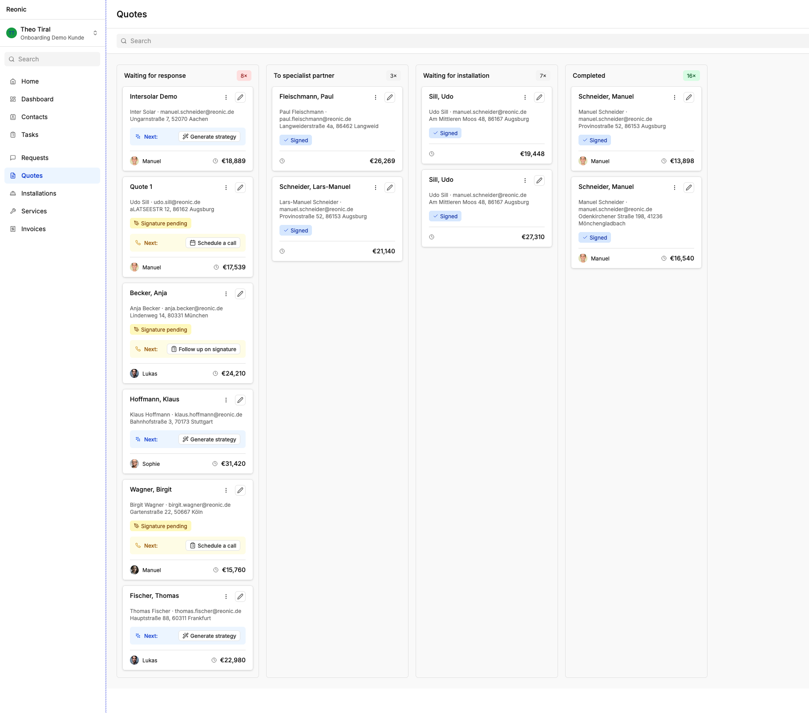
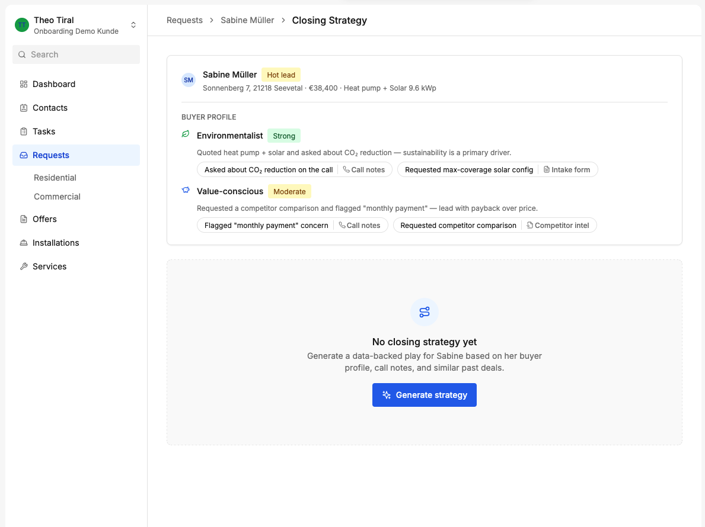
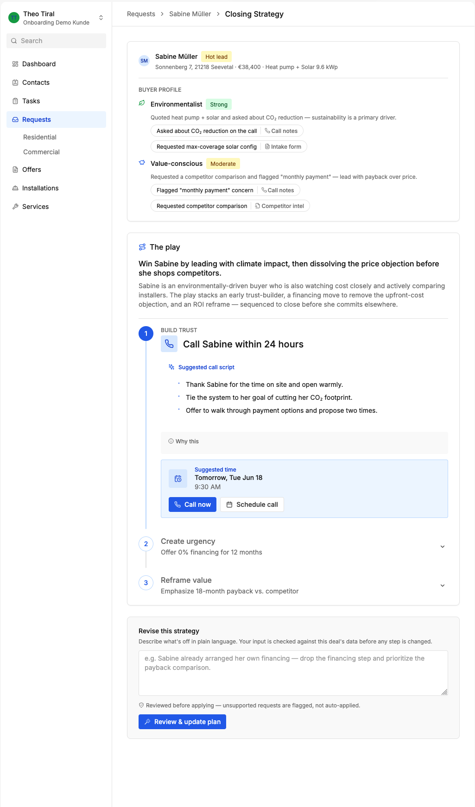
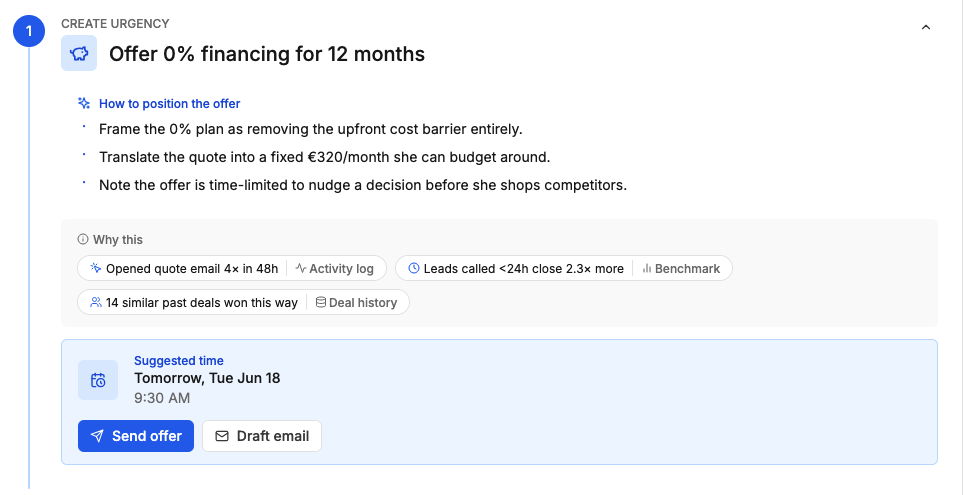
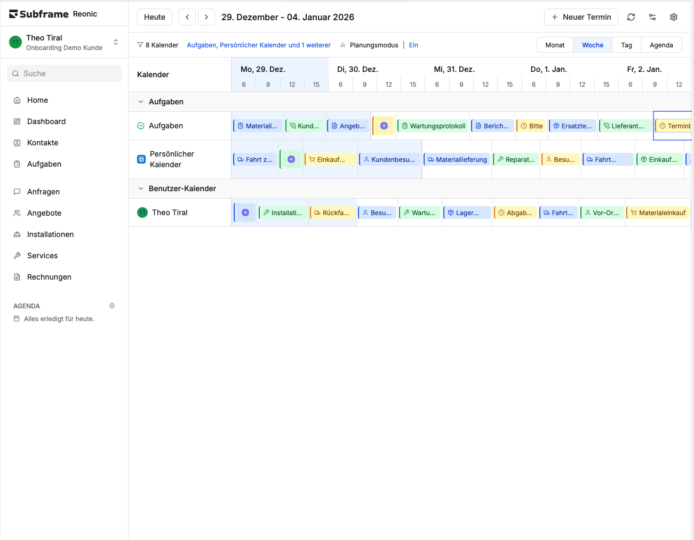
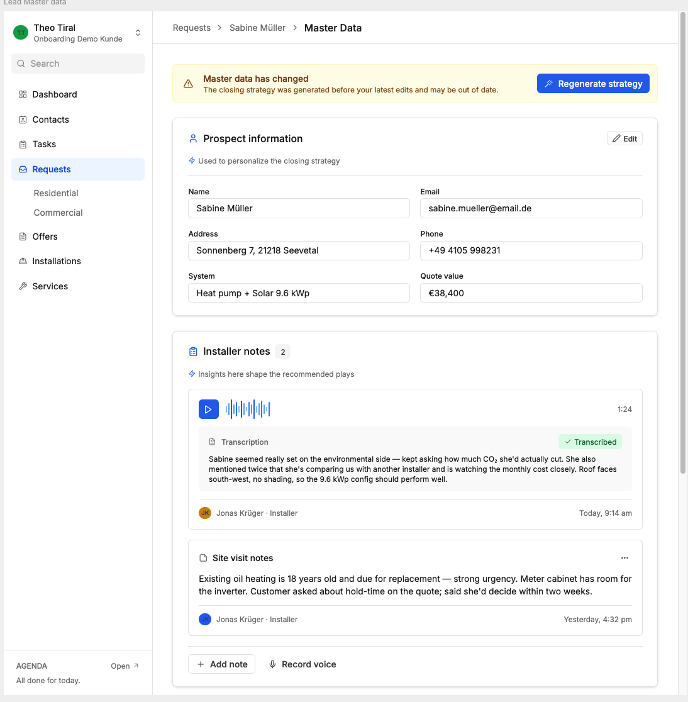

# Reonic AI-powered Expert Marketing Assistant for Renewable Energy Installers

## About the project

Reonic provided us with the following description of the project and its ideal outcomes:

**Background**

Solar installers spend time crafting personalized pitches to close sales, but they often lose momentum after sending the initial quote. Homeowners hesitate, get distracted, or receive competing offers. The gap between “quote sent” and “contract signed” is where deals die.**The opportunity:** Use AI to auto-generate personalized marketing sequences that keep prospects engaged, address their specific hesitations, reinforce ROI in *their* language, and create just enough urgency to push them over the line—without being pushy.Different customer types need different approaches:

- A **family** wants reassurance and peace of mind (“predictable bills, no surprises”)
- An **investor** wants hard ROI numbers and comparisons (“13% annual return vs. stock market”)
- An **environmentalist** wants impact narrative (“offset 150 tons of CO₂ over 25 years”)
- A **skeptic** needs objection handling (“yes, panels work in winter too”)

**The Challenge**

Build a system that takes a homeowner’s profile and quote data, then **generates a strategic communication chain** designed to move them from “quote received” to “contract signed.”The challenge is not just to generate emails—it’s to suggest a **coherent marketing approach** with reasoning, timing, and flexibility. Think of it as a persuasion strategy that an installer can understand, trust, and iterate on.Core Problem

- Homeowners hesitate after receiving quotes
- Installers lack time to personalize follow-up at scale
- Generic templates don’t move the needle
- There’s no clear “why this, at this time, in this tone?”

**Your job**: Help installers understand *why* a certain communication strategy makes sense for *this customer*, and give them tools to execute and adapt it.What You’ll BuildA working prototype that takes customer + quote data as input and outputs a **communication strategy** that’s:

1. **Strategically sound** – based on the customer’s actual motivations and concerns
2. **Visually compelling** – something an installer would want to show their sales manager (or the customer)
3. **Actionable & (bonus points) iterative** – not just “send this email,” but “here’s the approach, here’s why, and here’s how you can adjust it”
4. **Multi-channel aware (bonus points)** – emails are one option, but so are SMS, calls, video messages, proposals, or other creative touches

That’s it. No massive documentation needed. Impress us with what you build, not what you write about building it.Bonus Points 🚀

- **Multi-channel smarts** – suggests not just emails, but calls, SMS, video, or creative touches
- **Iteration built-in** – the installer can adjust strategy on the fly
- **Predictive insights** – warns “this customer might ghost” or “they’re ready to close now”
- **A/B testing framework** – suggests how to test different messaging
- **Beautiful UX** – something you’d be proud to show a customer
- **Localization** – works for different regions, languages, market conditions
- **Something unexpected** – an idea we didn’t think of that actually works

## About Reonic

See docs/about-reonic.md for a thorough description of what Reonic is all about, their features, and how it can be used by installers.

## Preliminary interview

We had an interview with the Reonic founders where they further explained the need for this project. See docs/preliminary-info.md for the details on this.

## Research

The `research` folder contains a massive amount of research information based on Germany-first and based on public web data, official sources, consumer/VOC evidence, and labeled transfer evidence. It does not use assumptions as facts. Don't read it right away, but rather search when necessary to find evidence-based information. While it contains lots of data, there might be gaps in it, but nevertheless it's a good dataset that can later be augmented with further research if deemed necessary by you.

## Goal

We'd like to create a real PoC of our proposed AI-powered marketing and sales assistant within a partially recreated version of Reonic's platform.

We need to demo this under 2 minutes, so we have created the following user flow that emphasizes the urgency and need for this feature, the installer's constraints (several leads to follow up on, yet limited capacity and time).

The first screen shows a Kanban board view of the offers/quotes that are not yet finalized by the customer. They can be at different stages like brand new (the next step would be to generate a strategy), or the installer might have already followed up and it's pending the next activity (e.g. schedule a call, follow up on a signature, etc.)

Once the user clicks the button in front of the next action, they are taken to the marketing strategy screen.
This view always shows an overview of the most important information from the customer's profile, so that installers can recall the specifics at a glance.
Based on both the information we know about the customer (which includes everything they provided in the quote request, the follow ups, emails, etc.), as well as information the AI engine has researched from both external (public customer reviews from places like Google Maps, TrustPilot, etc.) and internal (the marketing assistant's database of successful marketing and sales tactics based on each installer's customers and proven sales funnels that led to customers signing, which are shared in an anonymized way across all installers in the assistant's knowledgebase), the AI creates a "buyer profile". This profile shows the customer personas the assistant estimates the customer to have like "environmentalist" and "value-conscious", which help surfaces the customer needs, concerns, preferences, dislikes.

If this is a brand new quote, the screen shows that there is no closing strategy yet, and the next action is to generate it from all the available information including the marketing assistant's knowledgebase, customer data, quote info, reviews, similar sales, etc.

What's not in the screen yet but we should have: Here, it would be very helpful to show some dates as well such as the date the quote was originally sent, how many days it's been since as an indicator of staleness, and the date since the last action if there was one.

Once a closing strategy has been generated, the AI marketing assistant shows the next best action. In this example, it could be to build trust by scheduling a call within 24 hours after the quote was received.

The installer can decide to take an action such as to schedule the call or revise the strategy using the box below where they can explain why they think a different next step might be better, after which the AI assistant again goes and plans the next best action given this new suggestion and all the known data.

The date of the next action is automatically determined as a suggestion by the agent by looking at the installer's weekly calendar.

Another example: 

Once they click on schedule, they can see the scheduled item appear in their calendar.

There is another screen when you click on a customer's name where you can see the master data, including all the information known about the customer. Here we see not only the customer's data, but all the files, transcripts, etc. that we have on the client so far.

After performing one of the actions, e.g. taking a call or visiting the customer, the installer can return to the Kanban board, see the updated "Next:" area on each quotation item and click a Log button to add notes and files about what happened during that action, e.g. if the customer talked about their concerns like if the price is too much, if they need someone to come see the house in person, etc. The system would then use that information to generate the next best action.

We'd like to show one happy path of starting with a brand new quote, scheduling a call, added to calendar, logging what happened (customer wanted someone to come take a look at their house), following up with a personal visit, logging what happened, and finally the customer signing the contract.