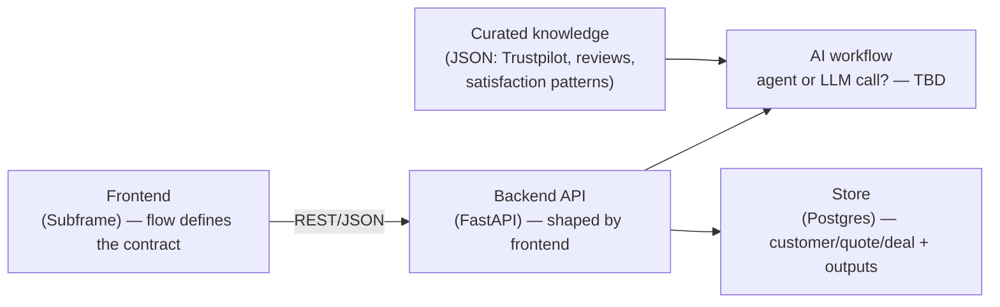
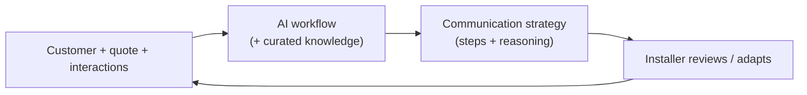

# Architecture (skeleton)

Bare-bones shape of **Never Ghosted**. Intentionally high-level: we define the
**frontend flow first** (what it looks like, what it needs), then pin the
backend contract and AI workflow to match. Details below are deliberately open.

Inputs reference: [`docs/metadata.md`](docs/metadata.md).

## Decide first (before refining this)

1. **Frontend flow** — screens + the journey an installer takes. This sets the
   API/SLA between frontend and backend. Everything backend follows from it.
2. **AI: agent vs single LLM call** — open. Leaning agent-ish because we want to
   pull in external knowledge (below), but not decided.
3. **Persistence + provider** — Postgres assumed; LLM provider TBD (OpenAI
   credits available).

## Pieces (shapes TBD)

## End-to-end flow (placeholder)

To be filled once the frontend flow exists. Rough intent:

## Curated knowledge input

A colleague is gathering real examples of what keeps customers happy (Trustpilot
scores, comments, web research), expected as **JSON**. It feeds the AI workflow
as reference material. How it's used — static context vs retrieval vs agent tool
— is part of the open agent-vs-LLM decision.

## Not yet decided (on purpose)

- Agent framework vs single structured LLM call.
- How curated knowledge is consumed (prompt context / retrieval / tool).
- Detailed data model, API endpoints, deployment — wait for the frontend flow.
