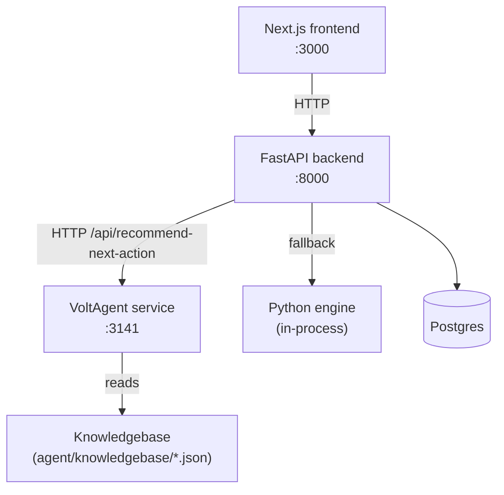
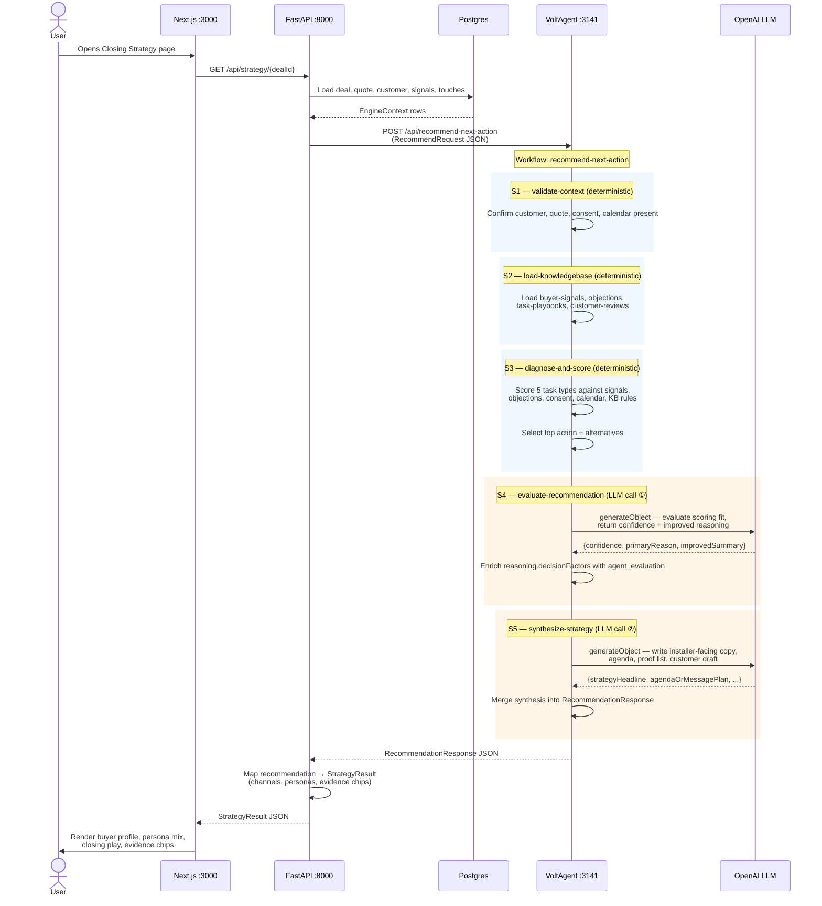

# Never Ghosted — Reonic Sales Assistant

A working demo of a Reonic-style sales assistant for the **post-quote** phase: it
reads a deal's quote, customer profile, installer notes, signals and history, then
writes a grounded, multi-channel **closing strategy** — and can reach for
out-of-the-box creative plays when the obvious email won't land.

## Architecture



- **Frontend** (`frontend/`, Next.js 14 + Subframe UI) — the browser talks only to the backend.
- **Backend** (`backend/`, FastAPI + Postgres) — owns deals/quotes/strategy. Routes
  every plan through a `StrategyEngine` seam.
- **Engine choice** — selectable per request from the strategy page dropdown:
  - **VoltAgent** (primary): calls M's TS agent service (`agent/`) on `:3141`, which
    reasons over the JSON knowledgebase. Falls back to the deterministic engine if the
    agent is unreachable (unless `REONIC_AGENT_STRICT=true`).
  - **Python** (backup): a local in-process engine (`engine/`). Needs `OPENAI_API_KEY`.
  - **Deterministic**: a no-LLM fixture engine for offline demos and tests.

## Happy-path flow (VoltAgent engine)

End-to-end sequence from "user opens Closing Strategy" to "rendered plan", including
every agentic step visible in the VoltOps console.



### VoltOps trace blocks per run

| # | Block | Type | Triggered by |
|---|-------|------|-------------|
| 1 | Workflow span | workflow | `recommendNextActionWorkflow.run()` |
| 2 | S1 validate-context | step | `andThen` chain |
| 3 | S2 load-knowledgebase | step | `andThen` chain |
| 4 | S3 diagnose-and-score | step | `andThen` chain |
| 5 | S4 evaluate-recommendation | step | `andThen` chain |
| 6 | LLM call (evaluation) | llm | `generateObject` in S4 |
| 7 | S5 synthesize-strategy | step | `andThen` chain |
| 8 | LLM call (synthesis) | llm | `generateObject` in S5 |

Open **console.voltagent.dev** → connect to `http://localhost:3141` to see live runs.

## Setup

```bash
cp .env.example .env      # then put a real OPENAI_API_KEY in it
```

This root `.env` is the **only** place keys live. The agent loads it (`../../.env`
in dev, `env_file` in Docker) and the backend reads it via `env_file` — nothing
reads a key from elsewhere.

With `OPENAI_API_KEY`, the agent's model (`VOLTAGENT_MODEL`) must be a **bare**
OpenAI id like `gpt-5-mini`. The default `openai/gpt-5-mini` carries an
OpenRouter-style prefix that the agent strips automatically when talking to OpenAI
directly; keep the prefix only if you point it at OpenRouter. If the model id is
wrong, the agent still returns a result but silently downgrades to its
deterministic wording (`generation.mode: "deterministic_fallback"`).

## Run

### Option A — docker compose (everything, recommended)

```bash
docker compose up --build
curl -X POST http://localhost:8000/admin/seed   # load the demo dataset (once)
```

Open **http://localhost:3000**. Services: frontend `:3000`, backend `:8000`,
agent `:3141`, Postgres `:5434`.

> In Docker the **Python** engine option falls back to the deterministic engine (the
> `engine/` package isn't bundled into the backend image). VoltAgent and Deterministic
> work fully. For the live Python engine, run the backend locally (Option B).

### Option B — by hand (4 terminals)

```bash
# 1. Postgres
docker compose up -d db

# 2. VoltAgent
cd agent && npm install && npm run start          # :3141

# 3. Backend
cd backend && uv sync && \
  NG_DATABASE_URL=postgresql+psycopg://ng:ng@localhost:5434/never_ghosted \
  uv run uvicorn app.main:app --reload --port 8000 # :8000
curl -X POST http://localhost:8000/admin/seed

# 4. Frontend
cd frontend && npm install && npm run dev          # :3000
```

## Using it

1. Open **http://localhost:3000/quotes** and pick a deal (e.g. Sabine Mueller).
2. Open the **Closing Strategy** page.
3. Top controls:
   - **Strategy engine** — VoltAgent (default) / Python / Deterministic.
   - **Think outside the box** — opt in to engine-emitted creative plays (gifts,
     vouchers, tactile mail). A "Generated by …" badge shows which engine wrote the plan.
4. Each step can be **drafted**, **added to the calendar**, or **revised** (the
   revision is checked against the deal's data before it's applied).

## Reset demo data

```bash
curl -X POST http://localhost:8000/admin/seed   # wipes + reseeds
```

## Tests

```bash
cd backend && uv run pytest          # 14 tests, needs Postgres on :5434
cd frontend && npm run build         # typecheck + production build
cd agent && npm test
```

The backend suite is pinned to the deterministic engine (`conftest.py`), so it runs
offline with no agent or API key.

## Notes & follow-ups

- **Knowledgebase enrichment** — the richer markdown in `research/` (personas,
  objection library, playbooks, strategy rules, case studies) is **not yet** merged
  into `agent/knowledgebase/*.json`. The existing JSON KB is sufficient for the demo;
  converting the five files is a follow-up (see `requirements.md` §5d).
- **Live VoltAgent** requires a valid `OPENAI_API_KEY` and the agent running on `:3141`.
  Without it, plans gracefully fall back to the deterministic engine.
