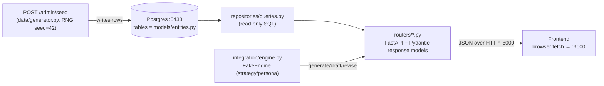
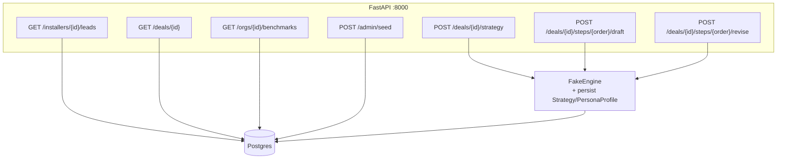

# Backend → Frontend wiring

The backend owns the data and the HTTP contract. No BFF: the browser calls
FastAPI directly (CORS open for dev). Data is populated once via `POST /admin/seed`.

## How data reaches the screen

## Endpoints the frontend consumes

- **Stored shapes:** `app/models/entities.py` (SQLModel tables) + `app/models/enums.py` (taxonomies).
- **Seed values:** `app/data/generator.py` — 1 org, 2 installers, 20 active + 100 terminal deals.
- **Strategy/persona:** `app/integration/engine.py::FakeEngine` (deterministic stand-in; swap for the real engine at `get_engine()`).
