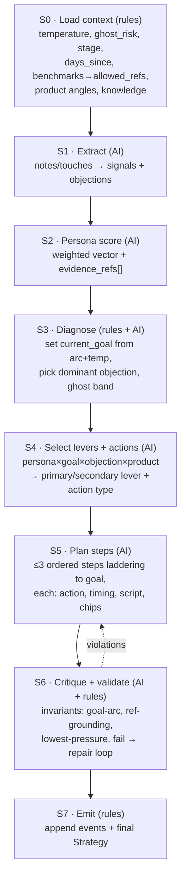

# Agent Pipeline + Contract Rewiring Plan

How we move from the `FakeEngine` stand-in to a **real, single agent that reasons
in ordered stages** before it emits a unique strategy per customer — and how we
make every layer (engine → backend → frontend) agree on the contract defined in
[`../metadata.md`](../metadata.md).

Builds on, does not replace:
- [`information_flow.md`](information_flow.md) — the 8-step AI-vs-deterministic split (the *what*).
- [`agent_plan.md`](agent_plan.md) — engine pillars P0–P6, already built on `feat/strategy-engine` (the *engine*).
- [`backend_plan.md`](backend_plan.md) — the HTTP seam + persistence (the *service*).

This doc owns the glue: **the agent's stage sequence, the action taxonomy, and
the three-layer contract reconciliation.**

---

## 1. The problem (why this exists)

**Inputs already conform; outputs don't.** The seed data
(`backend/app/data/generator.py`: Customer / Quote / Deal / Touch / Note / Signal)
already matches `metadata.md`. We do **not** need new fake *input* data. The
disagreement is entirely on the **output** side — the Strategy / Step / Persona /
EvidenceChip shapes the engine produces and the backend hands to the frontend.

Three Strategy *output* contracts currently diverge:

| Field | `engine/strategy.py` (real) | `backend/.../integration/engine.py` (seam) | `frontend/src/lib/types.ts` |
|-------|------------------------------|----------------------------------------------|------------------------------|
| step action | `task_type` (5 kinds) + `title` + `script` + `suggested_timing` + `secondary_lever` + `why` | `order` + `channel` + `rationale` only | mirrors backend (thin) |
| persona | `buyer_profile.personas[].evidence_refs[]` | flat `persona_scores[]`, **no evidence_refs** | no evidence_refs |
| chip text | `label` | `text` | `text` |
| summary | `summary` (the play) | — | — |
| temperature/ghost_risk | computed in P1 | declared, **never populated** | declared, unused |

The seam was written against `FakeEngine` before the engine merged, so it is the
**lossy** layer. The real engine already produces what `metadata.md` asks for;
the backend throws most of it away. **Rewiring = promote the engine's contract up
through the seam and into the FE**, not invent anything new.

---

## 2. The agent: ordered stages (the "steps one by one")

One agent. It does **not** emit a strategy in a single shot — it walks a fixed
sequence, and **each stage emits an append-only log event** (the trace the FE
renders). Deterministic stages are pure Python (free, testable); AI stages are
tiered LLM calls. This formalizes Engine B's `extract→persona→strategy→critic`
into the default path and names the stages we'd otherwise leave implicit.

Stage rules:
- **S0, S3(math), S6(checks), S7 are deterministic** — they never call a model.
  Benchmark/deal_history numbers come from here (`allowed_refs`); the model may
  only reference an id, never invent a stat. (Invariant from `agent_plan.md`.)
- **S1, S2, S4, S5 are AI** — language + judgment, constrained to Pydantic enums.
- **S6 repair loop** is bounded (max 1–2 retries, then degrade) so it can't burn
  budget; budget wrapper from engine P5 already enforces this.
- Persona (S2) is **cached per deal**, re-run only on new touches/notes.

"One agent for now" = this single sequential pipeline. Persona-debate /
multi-agent is explicitly **out** (research + `agent_plan.md` decision); revisit
only if the single agent measurably falls short.

---

## 3. Action taxonomy (not just email)

The whole point: the coach recommends the **right move**, which is often not an
email. The engine already has `TaskType`; we make it the canonical action set and
extend it. Each action carries an optional `channel` (from `metadata.md`'s
channel enum) and a pressure rank (trust-before-ask ordering favours low pressure
early).

| `task_type` | channel | Pressure | When the agent picks it |
|-------------|---------|----------|--------------------------|
| `phone_call` | call | low–med | hot/warm lead, <24h-call benchmark, objection to talk through |
| `send_email` | email | low | async nudge, share doc/quote recap, low engagement |
| `send_whatsapp` | whatsapp | low | channel_preference=whatsapp, quick check-in |
| `whatsapp_video` | whatsapp | med | personal touch, show face/site, skeptic/security_seeker |
| `meeting_in_person` | meeting | high | high-value deal, on_site_support, technical-fit objection |
| `schedule_site_visit` | meeting | high | roof_or_technical_fit objection, performance_doubt |
| `send_case_study` | email/whatsapp | low | social_proof lever, skeptic; uses local_installs_count |
| `send_gift` | — | low | relationship warmth, post-verbal-commit thank-you |
| `share_financing_offer` | email/call | med | upfront_cost / financing_concern objection |

> Proposal — `send_whatsapp`, `schedule_site_visit`, `send_case_study`,
> `share_financing_offer` are **additions** to the engine's current 5. Lock the
> final set before S4 prompt-writing. The lever→action mapping (e.g.
> `social_proof → send_case_study`, `proximity_trust → meeting_in_person`) lives
> in the S4 prompt + a deterministic fallback table.

Constraint kept from metadata: a step's `primary_lever` is chosen from the fixed
9-lever taxonomy; the **action** is *how* that lever is delivered. Lever and
action are separate axes — the agent picks both.

---

## 4. Rewiring pillars (sequenced, test-first)

Each ships green before the next. Tests named so a failure is obvious.

| # | Pillar | Layer | What ships | Failing test |
|---|--------|-------|-----------|--------------|
| **AP1** | **Canonical contract** | shared | Promote `engine/strategy.py`'s `Strategy/Step/BuyerProfile/EvidenceChip` to the seam. Backend `integration/engine.py` re-exports the engine models (or a 1:1 adapter). Rename chip `text`→`label` end to end (or alias). Ship a **contract-conformant fake strategy** (full Step shape, real refs) so the demo works before AP2. | backend `StrategyResult` round-trips an `engine.Strategy` with no field loss |
| **AP2** | **Real engine behind the seam** | backend | `get_engine()` returns the real pipeline (§2) instead of `FakeEngine`, LLM injected. `context.build()` already assembles inputs — feed them to `generate_strategy`. Build `allowed_refs` from `terminal_stage_counts` (real benchmark ids). | generated strategy passes `validate_strategy`; benchmark chip refs resolve |
| **AP3** | **Populate the derived fields** | backend | persist + expose `temperature`, `ghost_risk` (P1), persona `evidence_refs`, benchmark **lift** (not raw counts) on `GET /orgs/{id}/benchmarks`. | `/deals/{id}` returns non-null temperature; benchmark returns `{metric,lift,sample_size}` |
| **AP4** | **Stage trace endpoint** | backend | expose the append-only `StrategyEvent` log per deal (`GET /deals/{id}/strategy/log`) so the FE can render the agent flow (S0–S7). | log has one event per stage, append-only |
| **AP5** | **FE renders the rich contract** | frontend | `types.ts` + strategy page: action type + timing + script, secondary lever, persona evidence chips, temperature badge, benchmark lift chips, and the stage-trace flow. | strategy page shows a non-email action with its script + grounded chips |
| **AP6** | *(stretch)* compare A/B | both | "Compare" runs Engine B path, renders both from the same log. | — |

**Spine = AP1 → AP2 → AP3** makes the demo real: a unique, grounded, multi-action
strategy per customer. AP4–AP5 surface the reasoning. AP6 is the wow.

---

## 5. Invariants (carry over from the engine — non-negotiable)

- Benchmark / deal_history chip numbers are **deterministically computed**; the
  model references by id only (`allowed_refs`). Enforced in S6 `validate_strategy`.
- No step's `goal` exceeds `current_goal` (trust → urgency → close → ask).
- Every generate / regenerate / revise **appends** an event; nothing overwrites.
- Budget overrun degrades (fewer stages / cheaper model), never crashes.
- ≤ 3 steps surfaced (FE shows up to 3 tasks).

---

## 6. Open decisions (resolve before AP1)

1. **Contract home** — do backend + FE import the engine's Pydantic models
   directly (one source of truth, tighter coupling), or keep a thin backend
   mirror with an adapter? Recommend: backend imports engine models; FE mirrors
   in `types.ts` (it can't import Python).
2. **Final action set** — lock §3 (5 engine kinds vs the proposed 9).
3. **Provider/model** — engine `llm.py` is OpenAI structured-output today;
   confirm provider + the cheap/strong tier model ids before AP2 wires live calls.
