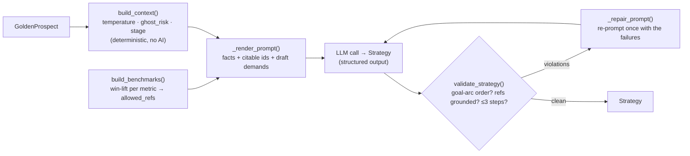

# Strategy Engine

Turns one ghosted quote into a grounded, low-pressure next-step plan. A single
structured LLM call wrapped in **deterministic facts** (computed, not guessed) and
**hard guardrails** (rejects invented stats / out-of-order asks). That scaffolding —
not raw model output — is why it beats a plain prompt-and-pray agent.

## Flow



- **Deterministic in/out** (`deterministic.py`, `benchmarks.py`): engagement
  temperature, ghost risk, and benchmark win-lift are pure Python. The model may
  cite a benchmark by `id` from `allowed_refs`, never invent the number.
- **One AI call** (`strategy.py`): persona vector + objections + ≤3 steps, each
  with a lever, timing, ready-to-send script, and grounded evidence chips.
- **Guardrails + repair** (`validate_strategy` → `_repair_prompt`): one bounded
  retry turns a failed draft into a fixed one before anything surfaces.

## Run

```bash
PY=../backend/.venv/bin/python3   # env has openai (+ the backend for A/B)

$PY -m engine.demo munich --stub  # no key, canned output (proves wiring)
$PY -m engine.demo munich         # live next-steps for one prospect
$PY ../ab_compare.py              # engine vs the basic agent, LLM-judged (6/6 wins)
```

## Where it plugs in

`backend/app/integration/real_engine.py` adapts the backend's `EngineContext`
into a `GoldenProspect`, runs `generate_traced`, and maps the result back to
`StrategyResult`. `get_engine()` returns it live when `OPENAI_API_KEY` is set, so
`POST /deals/{id}/strategy` (the "create strategy" button) hits this engine.

## Map

| File | Role |
|------|------|
| `models.py` | input entities (`GoldenProspect`) |
| `golden.py` | 6 mock prospects |
| `deterministic.py` | temperature / ghost_risk / goal-arc — pure |
| `benchmarks.py` | win-lift facts + `allowed_refs` |
| `strategy.py` | Engine A: prompt, call, validate, repair |
| `llm.py` | OpenAI structured-output adapter (key-gated) |
| `engine_b.py` | multi-call showpiece skeleton (phases injected; not yet built) |
| `log.py`, `budget.py` | append-only trace, token caps |
