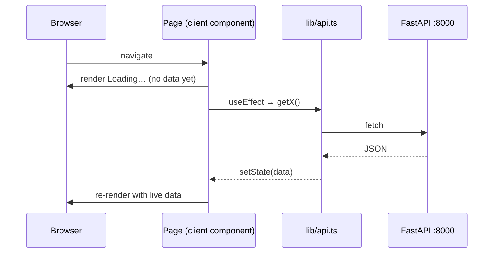

# Frontend → Backend wiring

Pages are **client components**. They fetch from FastAPI directly in the browser
(`NEXT_PUBLIC_API_URL`, default `http://localhost:8000`). **No BFF** — Next.js
serves the CSR pages only; it does not proxy or aggregate the API.

## Where data comes from on each page

```mermaid
flowchart LR
  subgraph Browser
    quotes["/quotes<br/>leads kanban"]
    deal["/requests/[id]<br/>deal detail"]
    strat["/requests/[id]/strategy<br/>the play"]
    api["lib/api.ts<br/>(fetch helpers)"]
    types["lib/types.ts<br/>(mirrors API JSON)"]
  end
  be["FastAPI :8000"]

  quotes -->|getLeads(1)| api
  deal -->|getDeal(id)| api
  strat -->|generateStrategy / draftStep / reviseStep| api
  api -->|HTTP JSON| be
  api -.->|typed as| types
```

## Render lifecycle (why a page shows "Loading…" first)



- **The contract seam:** `src/lib/types.ts` — TS interfaces match the backend Pydantic
  response field names exactly. If the API changes, update here.
- **All fetches:** `src/lib/api.ts` — one helper per endpoint, no scattered `fetch`.
- Initial paint is the loading state; data appears after the client fetch resolves.
